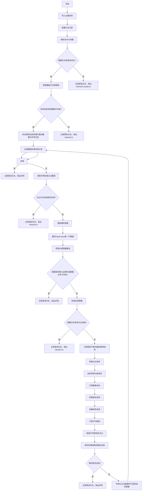

# pc_pano_fusion

```mermaid
flowchart TD
    A[开始] --> B[导入必要的库]
    B --> C[配置日志记录]
    C --> D[解析命令行参数]
    D --> E{数据主目录是否存在?}
    E -->|是| F[获取数据子目录路径]
    E -->|否| G[记录错误日志，抛出FileNotFoundError]
    F --> H{是否找到有效数据子目录?}
    H -->|是| I[验证相机姿态和激光雷达数据文件存在性]
    H -->|否| J[记录警告日志，抛出ValueError]
    I --> K[读取相机姿态数据文件为DataFrame]
    K --> L{文件是否为空或读取出错?}
    L -->|是| M[记录错误日志，抛出异常]
    L -->|否| N[读取并预处理点云数据]
    N --> O{点云文件处理是否失败?}
    O -->|是| P[记录错误日志，抛出ValueError]
    O -->|否| Q[提取通用参数]
    Q --> R[遍历DataFrame每一行数据]
    R --> S[获取全景图像路径]
    S --> T{数据是否缺少必要列或图像文件不存在?}
    T -->|是| U[记录错误日志，抛出异常]
    T -->|否| V[处理全景图像]
    V --> W{图像文件是否无法读取?}
    W -->|是| X[记录错误日志，抛出ValueError]
    W -->|否| Y[计算相机平移向量和旋转矩阵]
    Y --> Z[转换点云坐标]
    Z --> AA[坐标转换为极坐标]
    AA --> AB[计算像素坐标]
    AB --> AC[获取颜色信息]
    AC --> AD[收集颜色信息]
    AD --> AE[计算平均颜色]
    AE --> AF[赋值平均颜色给点云]
    AF --> AG[保存处理结果到输出目录]
    AG --> AH{保存是否出错?}
    AH -->|是| AI[记录错误日志，抛出异常]
    AH -->|否| AJ[可视化点云数据并可选择保存图像]
    AJ --> K[记录数据处理完成日志]
    K --> L[结束]
```

